<!-- ==================== INTRODUCTION ==================== -->
<h1 align="center">Hi, I'm Alongkon Chanthiang 👋</h1>

<!-- ==================== TYPING ANIMATION ==================== -->

  

---

<!-- ==================== ABOUT ME ==================== -->
## 🧑‍💻 About Me

- 💜 Backend / Full-Stack / Roblox developer.
- 🧩 I build APIs, games, and live-integration systems.
- ⚙️ Currently working with **TypeScript, Node.js, Next.js** and **Lua (Roblox)**.
- 📫 Reach me on GitHub: [@alongkon2103](https://github.com/alongkon2103)

---

<!-- ==================== TECH STACK ==================== -->
## 🛠️ Tech Stack

  
  
  
  
  
  
  
  
  
  

---

<!-- ==================== CURRENT PROJECTS ==================== -->
## 🚀 Current Projects

| Project | Description |
| --- | --- |
| 🎮 **Roblox Games** | Building and shipping games on the Roblox platform (Lua). |
| 🏪 **Class A Store** | Online store / e-commerce project. |
| 🔴 **TikTok Live Integration** | Real-time integration with TikTok Live events. |
| 🔌 **Backend APIs** | Designing and maintaining REST APIs with Node.js / Express. |

---

<!-- ==================== GITHUB STATS ==================== -->
## 📊 GitHub Stats

<!--
  Generated by the "lowlighter/metrics" GitHub Action (.github/workflows/metrics.yml).
  The SVG is committed to this repo as github-metrics.svg, so it never depends on a
  live third-party server at render time. Replaces the paused Vercel github-readme-stats.
-->

  

---

<!-- ==================== GITHUB STREAK ==================== -->
## 🔥 GitHub Streak

  

---

<!-- ==================== CONTRIBUTION SNAKE ==================== -->
## 🐍 Contribution Snake

  <picture>
    <source media="(prefers-color-scheme: dark)" srcset="https://raw.githubusercontent.com/alongkon2103/alongkon2103/output/github-snake-dark.svg" />
    <source media="(prefers-color-scheme: light)" srcset="https://raw.githubusercontent.com/alongkon2103/alongkon2103/output/github-snake.svg" />
    
  </picture>

---

<!-- ==================== VISITOR COUNTER ==================== -->
## 👀 Visitor Counter

  

